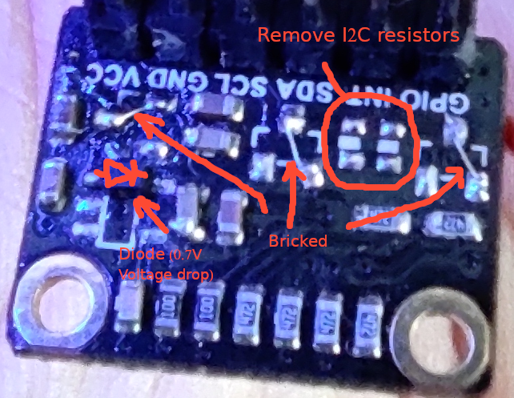
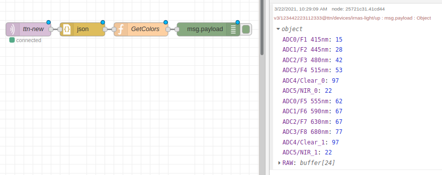

## AS7341 low power

Add your keys in app_conf.h

### HW

Dirty HW hack

We remove regulators, and use 2.8V over one diode to get 2.1V

Maximum voltage for AS7341 is 2.0V.

It would be better if we could provide 1.8V on sensor VCC.

I2C resistors are removed as generic node has them on board.

I2C FETs are removed and bricked - they are used for 5V - 3.3V so we do not need them.

Working node consumption should be around 5uA in sleep mode.

### Downlink

Name|Type|Size|Description|Usage
--|--|--|--|--
SET_TIME|0x01|1 byte|Time in minutes
SET_LED|0x02|1 byte| 1(ON)/0(OFF)
SET_REGISTER|0x03|2 bytes|1. register 2. data
SET_ATIME|0x04|1 byte|Setting ATIME
SET_ASTEP|0x05|2 bytes|1. ASTEP HIGH 2. ASTEP LOW
SET_GAIN|0x06|1 byte|Setting AS7341 gain
RESET_NODE|0x08|0 bytes

#### Usage

Message|Description
--|--
0x01 0x05 | Set interval to 5 minutes
0x02 0x01 | Use LED
0x02 0x00 | do not use LED
0x03 0x80 0x00 | Write 0x00 to register 0x80
0x04 0x09 | Set ATIME to decimal 9
0x05 0x01 0xF3 | Set ASTEP to 499
0x06 0x05 | Set gain to 5 (maximum is 10)
0x07 | Reset node

### Node Encoder

https://github.com/goran-mahovlic/generic-node-se/tree/develop/AS7341/node.function
